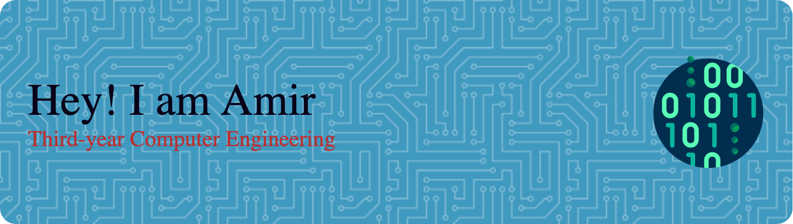

### Hi there 👋, my name is Amir Rezaei
#### I am a third-year computer engineering student at Toronto Metropolitan University.
👨‍💻 As a passionate third-year Computer Engineering student at Toronto Metropolitan University, I specialize in crafting efficient and user-friendly software solutions. With a strong foundation in Python, Java, C, and web development, I bring a blend of academic rigour and practical experience to the table. I thrive on collaborative projects, as demonstrated by my leadership in team endeavours and a consistent track record of process improvement initiatives. Check out my repositories for a peek into my academic projects and my journey through the intricate world of coding, from elegant algorithms to robust applications.

Skills: Python/ C (Programming Language)/ Java/  SQL/ Assembly Language

      

